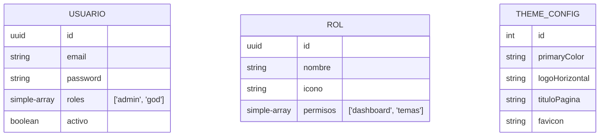

# Arquitectura Técnica

## Estructura del Proyecto

El proyecto está organizado en un monorepo (o estructura similar) con separación clara entre cliente y servidor.

### 1. Backend (`/backend`)
El backend sigue la arquitectura modular de NestJS.

*   **`app.module.ts`**: Módulo raíz que orquesta todos los sub-módulos.
*   **Módulos Principales**:
    *   `AuthModule`: Maneja la validación de credenciales y emisión de tokens JWT.
    *   `UsuariosModule`: CRUD de usuarios y asignación de roles.
    *   `RolesModule`: Gestión de definiciones de roles (ej: Admin, Soporte) y sus permisos asociados.
    *   `ThemeModule`: Persistencia de la configuración visual (colores, logos) y metadatos SEO.
*   **Entidades (TypeORM)**:
    *   `Usuario`: Almacena credenciales, nombre, y un array de roles.
    *   `Rol`: Define `nombre`, `icono` y un array de `permisos` (strings).
    *   `ThemeConfig`: Tabla única (singleton) para la configuración global del sitio.

### 2. Frontend (`/frontend`)
Aplicación SPA (Single Page Application) construida con React y Vite.

*   **Rutas (`App.tsx`)**: Definición de rutas públicas (Login) y privadas (Dashboard).
*   **Contexto (`ContextoAutenticacion.tsx`)**: Manejo global del estado de sesión (`usuario`, `login`, `logout`).
*   **Librerías (`src/lib`)**:
    *   `cliente-axios.ts`: Instancia de Axios configurada con interceptores para inyectar el Token JWT automáticamente.
    *   `theme-manager.ts`: Servicio encargado de inyectar variables CSS y metadatos SEO en el DOM dinámicamente.
*   **Componentes Clave**:
    *   `BarraLateral.tsx`: Menú de navegación inteligente. Determina qué ítems mostrar basándose en los permisos del usuario y la configuración de la BD.
    *   `LayoutDashboard.tsx`: Estructura base del panel administrativo.

## Flujo de Datos

1.  **Carga Inicial (Login)**:
    *   El usuario ingresa credenciales.
    *   El sistema carga la configuración visual (`/theme/config`) antes incluso de autenticar para mostrar el logo correcto.
2.  **Autenticación**:
    *   Backend valida y retorna un JWT que contiene el ID y Roles del usuario.
    *   Frontend guarda el JWT y decodifica los roles.
3.  **Navegación (RBAC - Role Based Access Control)**:
    *   `BarraLateral` consulta al backend la configuración de permisos actual.
    *   Cruza los roles del usuario con los permisos configurados.
    *   Filtra las opciones de menú visibles.
    *   **Excepción**: Usuarios con rol `god` ven todo incondicionalmente.

## Base de Datos (Esquema Simplificado)

